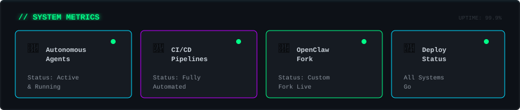
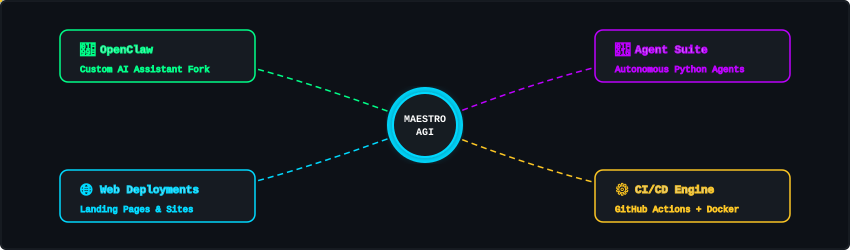

 

  <em>Building intelligent systems that think, act, and deploy autonomously.</em>

### `> whoami`

Soy un **DevOps & Automation Engineer** obsesionado con llevar la automatización al extremo. Diseño pipelines CI/CD que se mantienen solos, construyo agentes autónomos que ejecutan tareas sin supervisión, y contribuyo a proyectos open source.

> *Mi filosofía: si lo haces dos veces, automatízalo.*

### `> tech_stack --list`

### `> system_status --dashboard`

### `> projects --graph`

 

| Project | Description | Stack |
|:--------|:------------|:------|
| [OpenClaw](https://github.com/maestroagi/openclaw) | Custom fork con CI/CD automatizado, upstream sync, webhooks & Telegram alerts | TypeScript, Docker, GitHub Actions |
| [Agent Suite](https://github.com/maestroagi/test-agent-001) | Agentes autónomos para automatización de tareas | Python |
| [AGI Deployments](https://github.com/maestroagi/WEBSITE_AGI_DEPLOYMENTS) | Web deployments y landing pages | HTML, CSS, JS |

### `> stats --verbose`

<table>
<tr>
<td>

</td>
<td>

</td>
</tr>
</table>

### `> contribution_map --animate`

<picture>
  <source media="(prefers-color-scheme: dark)" srcset="https://raw.githubusercontent.com/maestroagi/maestroagi/output/github-snake-dark.svg" />
  
</picture>

 

