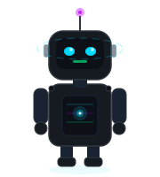

<div align="center">


<br/>

<p>
  <em>Building intelligent systems that think, act, and deploy autonomously — for the benefit of all.</em>
</p>

<a href="https://github.com/maestroagi">
  
</a>
<a href="https://github.com/maestroagi?tab=followers">
  
</a>
<a href="https://github.com/maestroagi?tab=repositories">
  
</a>

</div>


### `> whoami`

I'm a **DevOps & Automation Engineer** obsessed with pushing automation to its absolute limit. I design self-maintaining CI/CD pipelines, build autonomous agents that execute tasks without supervision, and contribute to open source projects that serve human progress.

> *My philosophy: if you do it twice, automate it. If you automate it, make it recursive. If it's recursive, open-source it.*


### `> cat mission.md`

<div align="center">

</div>


### `> tech_stack --list`

<div align="center">

</div>


### `> system_status --dashboard`

<div align="center">

</div>


### `> projects --graph`

<div align="center">

</div>

<br/>

| Project | Description | Stack |
|:--------|:------------|:------|
| [OpenClaw](https://github.com/maestroagi/openclaw) | Custom fork with automated CI/CD, upstream sync, deploy webhooks & Telegram alerts | TypeScript, Docker, GitHub Actions |
| [Agent Suite](https://github.com/maestroagi/test-agent-001) | Autonomous agents for recursive task automation | Python |
| [AGI Deployments](https://github.com/maestroagi/WEBSITE_AGI_DEPLOYMENTS) | Web deployments and landing pages for AGI projects | HTML, CSS, JS |


### `> stats --verbose`

<div align="center">
<table>
<tr>
<td>

</td>
<td>

</td>
</tr>
</table>
</div>


### `> contribution_map --animate`

<div align="center">
<picture>
  <source media="(prefers-color-scheme: dark)" srcset="https://raw.githubusercontent.com/maestroagi/maestroagi/output/github-snake-dark.svg" />
  
</picture>
</div>


### `> cat principles.md`

```
┌─────────────────────────────────────────────────────────────────┐
│                                                                 │
│   01. The value of a dignified human life is the highest value  │
│   02. Technology exists to amplify human potential              │
│   03. Open source is the engine of collective progress          │
│   04. Auto-recursivity: systems that improve themselves         │
│   05. Automate to liberate, not to replace                     │
│   06. Share knowledge freely — it belongs to everyone           │
│                                                                 │
└─────────────────────────────────────────────────────────────────┘
```

<br/>

<div align="center">



<br/>


</div>
